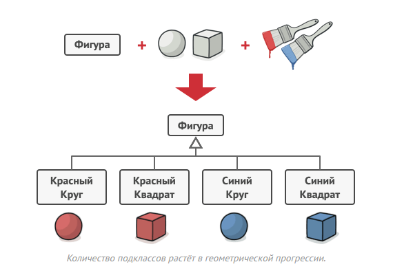
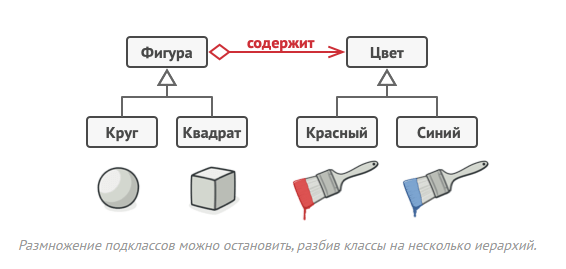

###Bridge (Мост) 
Это структурный паттерн проектирования, который разделяет один или несколько классов на две отдельные иерархии 
— абстракцию и реализацию, позволяя изменять их независимо друг от друга.

  

#####Проблема
У вас есть класс геометрических Фигур, который имеет подклассы Круг и Квадрат. Вы хотите расширить иерархию фигур по 
цвету, то есть иметь Красные и Синие фигуры. Но чтобы всё это объединить, вам придётся создать 4 комбинации подклассов, 
вроде СиниеКруги и КрасныеКвадраты.

При добавлении новых видов фигур и цветов количество комбинаций будет расти в геометрической прогрессии. Например, 
чтобы ввести в программу фигуры треугольников, придётся создать сразу два новых подкласса треугольников под каждый цвет. 
После этого новый цвет потребует создания уже трёх классов для всех видов фигур. Чем дальше, тем хуже.

  

#####Решение
Корень проблемы заключается в том, что мы пытаемся расширить классы фигур сразу в двух независимых плоскостях — по виду
 и по цвету. Именно это приводит к разрастанию дерева классов.

Паттерн Мост предлагает заменить наследование агрегацией или композицией. Для этого нужно выделить одну из таких 
«плоскостей» в отдельную иерархию и ссылаться на объект этой иерархии, вместо хранения его состояния и поведения внутри одного класса.

Таким образом, мы можем сделать Цвет отдельным классом с подклассами Красный и Синий. Класс Фигур получит ссылку на объект 
Цвета и сможет делегировать ему работу, если потребуется. Такая связь и станет мостом между Фигурами и Цветом. 
При добавлении новых классов цветов не потребуется трогать классы фигур и наоборот.